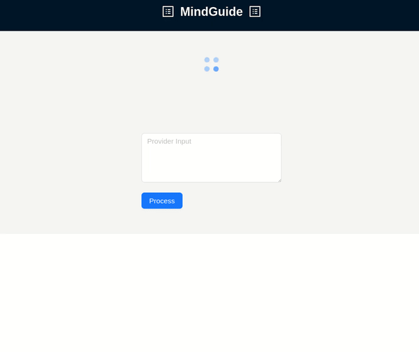

# Mind-Guide

Mind-Guide is a full-stack application for assisting in the diagnosis and treatment planning for psychiatric care.

## Demo



## Project Structure

- `backend/`: Go backend application.
- `frontend/`: React frontend application.
  - For now, the backend also contains the knowledge and patients database.
- `Dockerfile`: Docker configuration for building and running the application.

## Setup

1. Clone the repository:
   ```
   git clone https://github.com/axelstr/mind-guide.git
   cd mind-guide
   ```

2. Set up the backend:
   ```
   cd backend
   go mod tidy
   ```

3. Set up the frontend:
   ```
   cd frontend
   npm install
   ```

4. Create an OpenAI API key. [See documentation](https://platform.openai.com/docs/quickstart).

## Running the Application

Using docker is easiest. However, for development, it's recommended to start the frontend and backend separately without docker so they can be iterated on and restarted independently.

The application will be available at `http://localhost:3000`.

### Using Docker

This approach only requires a dependency to `docker-compose`.

1. To start the application:
   ```
   OPENAI_API_KEY={your_openai_api_key} docker-compose up --build
   ```

2. To close the application:
   ```
   docker-compose down
   ```

### Without Docker

This approach requires both local `go` and `npm` installations.

1. Start the backend:
   ```
   cd backend
   go run cmd/server/main.go
   ```

2. In a new terminal, start the frontend:
   ```
   cd frontend
   npm start
   ```
